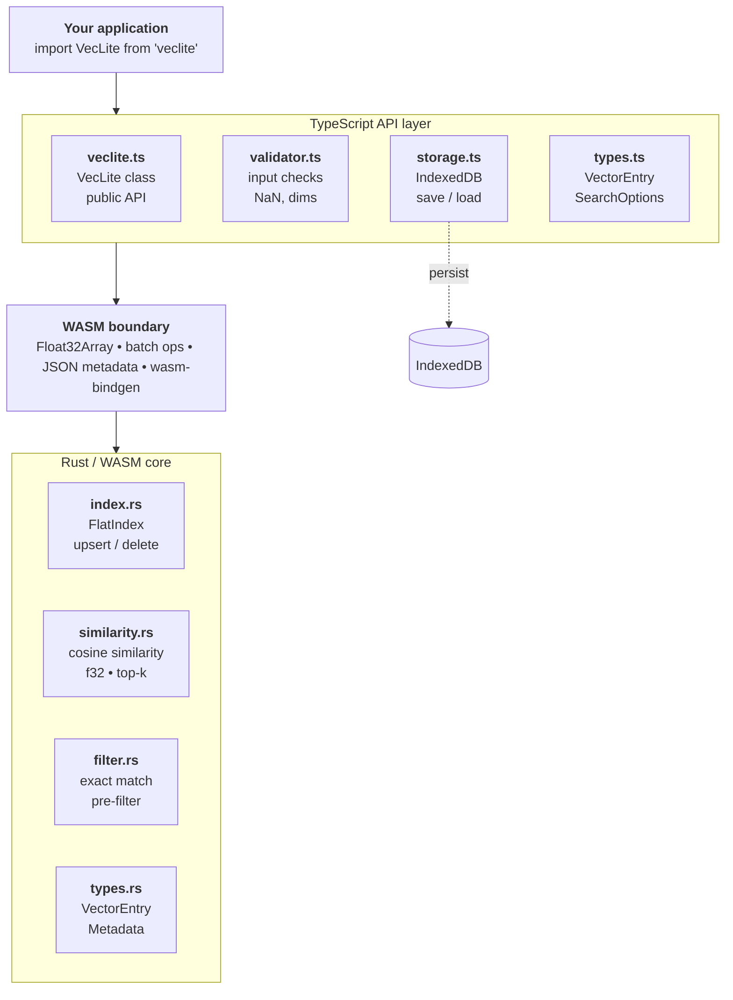

# VecLite Architecture

VecLite is built on a hybrid architecture that splits responsibilities between a client-facing TypeScript layer and a high-performance Rust/WASM core. 

## The Three-Layer Architecture

To maintain performance, stability, and excellent developer experience (DX), VecLite strictly adheres to a three-layer architecture. We never mix concerns across these layers.

### 1. TypeScript API Layer
This is the developer-facing surface of the library. It is responsible for:
- **Developer Experience (DX):** Providing a clean, familiar class-based API.
- **Validation:** Ensuring *all* input is strictly validated (checking for array dimensionality mismatches, `NaN`, and `Infinity`) *before* it ever crosses the WASM boundary.
- **Persistence:** Interacting with the generic `StorageAdapter` interface (IndexedDB, Memory) to save and load the stateful vector index.
- **Async Operations:** All asynchronous operations (I/O, database initialization, initial `.wasm` fetching) are explicitly restricted to this layer.

### 2. WASM Boundary
WebAssembly boundary crossings typically carry overhead. To achieve our fast benchmarks, we enforce strict rules at the JS-to-WASM boundary:
- **Batching:** We never invoke WASM functions in a loop. Data iterations (`upsert`, `search`, `delete`) must cross the boundary in bulk.
- **Memory Sharing:** Vector embeddings are passed globally as a contiguous `Float32Array`. We avoid passing nested JS arrays to utilize optimized memory transfers and prevent excessive object allocation.
- **JSON Serialization:** Metadata objects are stringified into JSON in TypeScript and parsed in Rust, allowing flexible structures gracefully.

### 3. Rust/WASM Core
The core engine is built natively in Rust. It does **pure computation only**. It is responsible for:
- **High-Performance Memory:** Leveraging contiguous `f32` float layout in WASM linear memory bypassing standard V8 JavaScript garbage collector performance degradation.
- **Algorithms:** For `v0.1`, the core implements a Brute-force exact-match flat index using cosine similarities. All metadata filtering happens in a pre-filtering pipeline step prior to doing heavy dot-product calculations.
- **Deterministic state:** There are no async operations or hidden browser API calls occurring inside the Rust code.

## Why this Architecture?

Pure TypeScript/JavaScript vector search engines typically plateau at roughly 1,000 to 5,000 vectors before the JavaScript Garbage Collector pauses become noticeably slow. 

By enforcing strict input sanitation cleanly on the TypeScript side and offloading the heavy algebraic lifting to highly optimized flat memory space inside WASM, VecLite handles 10,000 to 100,000+ vector limits efficiently right in the user's browser, free of external cloud database latencies. 

For the complete rationale regarding specific data-typing, index choices, and storage designs, read our [Architecture Decision Records (ADRs)](../DECISIONS.md).
